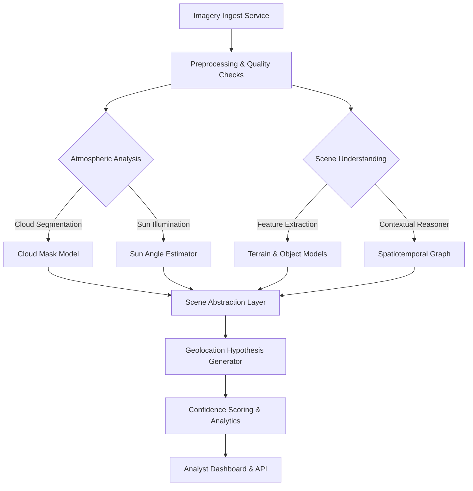

# GeoINT Environmental Intelligence Service

## Vision
Develop an AI-augmented geospatial intelligence (GEOINT) service that ingests satellite or aerial imagery, evaluates environmental context (e.g., cloud cover, solar illumination, surrounding terrain), synthesizes the findings into a structured scene representation, and estimates the most probable geographic region depicted.

## Guiding Principles
- **Modular design:** Separate ingestion, analysis, reasoning, and reporting so teams can iterate independently.
- **Data-centric AI:** Favor high-quality curated datasets, robust labeling, and continual validation alongside model experimentation.
- **Explainability-first:** Provide human-interpretable insights at each stage (e.g., heatmaps, uncertainty metrics) to support analyst trust.
- **Operational readiness:** Build with deployability, observability, and security in mind from the outset.

## Algorithmic Blueprint

### Stage-by-Stage Breakdown
1. **Imagery Ingest Service**
   - Accept uploads via REST/gRPC, or pull from storage buckets/S3.
   - Validate metadata (capture time, sensor type) and enforce schema versioning.
2. **Preprocessing & Quality Checks**
   - Radiometric calibration, orthorectification, resolution harmonization.
   - Reject imagery with insufficient resolution or severe artifacts.
3. **Atmospheric Analysis**
   - **Cloud Segmentation:** Train a semantic segmentation model (e.g., U-Net, SegFormer) on labeled cloud masks; produce binary + fractional cover maps.
   - **Sun Angle Estimation:** Combine capture timestamp with ephemeris models or infer from shadow vectors using a CNN-regressor trained on synthetic shadow datasets.
4. **Scene Understanding**
   - **Feature Extraction:** Detect terrain classes (water, urban, vegetation, snow) and objects (roads, runways) using multimodal encoders (Vision Transformers, SAM-based pipelines).
   - **Contextual Reasoner:** Build a scene graph or vector embedding capturing spatial relationships, time-of-day cues, and climatology priors.
5. **Scene Abstraction Layer**
   - Fuse atmospheric and terrain features into a structured representation (JSON schema) including uncertainties.
   - Store embeddings in a vector database for retrieval-augmented reasoning.
6. **Geolocation Hypothesis Generator**
   - Compare embeddings against georeferenced corpora (e.g., known airfields, coastlines) using metric learning.
   - Incorporate Bayesian filtering with external layers (weather feeds, DEMs) to refine candidate regions.
7. **Confidence Scoring & Analytics**
   - Surface top-N location hypotheses with probability intervals.
   - Generate human-readable narratives and visual overlays (cloud masks, sun direction arrows, detected features).
8. **Analyst Dashboard & API**
   - Provide a web UI plus machine-to-machine APIs.
   - Include audit logs, download endpoints, and alerting hooks.

## Product Roadmap
| Phase | Focus | Key Outcomes |
|-------|-------|--------------|
| **0. Discovery (Weeks 0-2)** | Requirements gathering, data inventory, legal/compliance review | Stakeholder map, prioritized use-cases, data governance charter |
| **1. Foundations (Weeks 3-8)** | Data pipelines, labeling tooling, baseline models | Automated ingest ETL, annotation guidelines, MVP cloud mask model |
| **2. Scene Intelligence (Weeks 9-16)** | Terrain/object models, sun-angle estimation, fusion pipeline | Trained feature extractors, illumination estimator, scene abstraction schema |
| **3. Geolocation Reasoner (Weeks 17-22)** | Hypothesis generation, retrieval infrastructure, uncertainty modeling | Vector search cluster, geospatial priors integration, calibrated scoring |
| **4. Delivery Layer (Weeks 23-28)** | API/UI development, observability, security hardening | Analyst dashboard, monitoring dashboards, role-based access control |
| **5. Continuous Improvement (28+ Weeks)** | Active learning loops, MLOps, performance tuning | Online evaluation loops, model registry, automated retraining triggers |

## Technical Stack Options
- **Ingestion:** Python/FastAPI, Go, or Rust microservices; message brokers (Kafka/NATS) for asynchronous tasks.
- **Storage:** Object storage (S3/GCS), PostGIS for metadata, vector DB (Pinecone, Weaviate, pgvector) for embeddings.
- **Processing:** Distributed compute with Ray, Spark, or Kubernetes Jobs; GPU acceleration where needed.
- **Model Development:** PyTorch or TensorFlow; Hugging Face ecosystem for transfer learning; MLFlow for experiment tracking.
- **Visualization:** Deck.gl/Mapbox for geospatial rendering; Plotly/Kepler.gl for analytics.
- **MLOps:** Kubeflow, Airflow, or Prefect pipelines; Argo Workflows for CI/CD.

## Data Strategy & Governance
- Curate multi-sensor datasets (EO, SAR, multispectral) with consistent licensing.
- Establish annotation protocols for cloud masks, terrain labels, shadow vectors, and unique geographic landmarks.
- Implement data versioning (DVC/LakeFS) and lineage tracking.
- Enforce access controls and encryption in transit/at rest to comply with GEOINT security standards.

## AI/ML Development Steps
1. Stand up an **experiment sandbox** with GPU access and notebooks (Jupyter/VSCode).
2. Build **baseline models** on public datasets (e.g., Sentinel-2, Landsat) before ingesting proprietary imagery.
3. Evaluate using metrics aligned to mission success (IoU for segmentation, MAE for sun angle, top-k accuracy for geolocation).
4. Implement **active learning** workflows to prioritize labeling of ambiguous regions.
5. Monitor model drift and create alert thresholds for retraining triggers.

## Deployment & Operations
- Containerize services (Docker) and orchestrate via Kubernetes or ECS.
- Deploy inference endpoints with autoscaling and GPU scheduling.
- Integrate logging (ELK/Opensearch), metrics (Prometheus/Grafana), and tracing (OpenTelemetry).
- Schedule periodic red-team exercises to validate security posture.

## Risk Mitigation
- **Data scarcity:** Augment with synthetic data, transfer learning, and simulation of shadows/weather.
- **Model bias:** Perform geographic stratified evaluation and fairness audits.
- **Operational latency:** Benchmark end-to-end pipeline; use model distillation/quantization where needed.
- **Explainability gaps:** Embed saliency maps, attention visualizations, and textual rationales in reports.

## Next Actions Checklist
- [ ] Finalize user stories and success metrics with stakeholders.
- [ ] Inventory candidate datasets and licensing constraints.
- [ ] Prototype cloud segmentation model with open data.
- [ ] Design scene abstraction JSON schema and storage strategy.
- [ ] Outline API contracts for ingest, analytics, and reporting.

## References & Further Reading
- NGA GEOINT standards documentation.
- ESA Sen2Cor preprocessing guidelines for Sentinel imagery.
- Research on vision-language models for geolocation (e.g., CLIP-based localization).
- Open-source toolkits: Microsoft Planetary Computer, Radiant MLHub, SpaceNet datasets.
